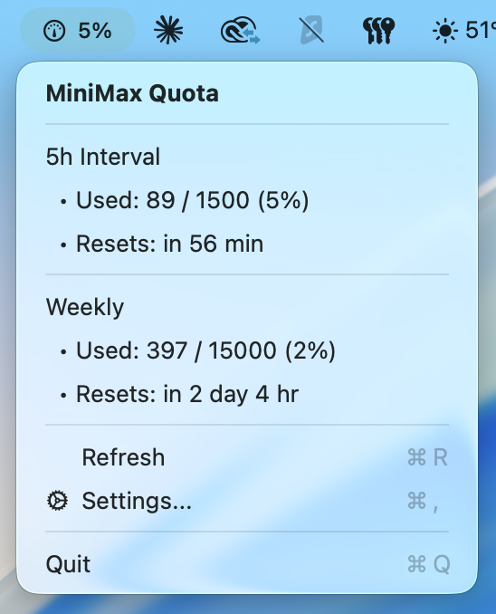

# MiniMaxQuotaBar

A macOS menu bar app that displays your MiniMax API quota usage in real-time.


## Features

- 📊 **Real-time quota monitoring** - Displays your MiniMax API usage percentage in the menu bar (shows the more critical quota)
- 📅 **Dual quota tracking** - Monitors both 5-hour interval and weekly quotas
- 🔄 **Auto-refresh** - Automatically updates every 5 minutes
- 🎨 **Status indicators** - Color-coded status icons (green/yellow/red)
- 🍎 **Native macOS** - Runs as a menu bar app (no dock icon)
- 🔐 **Secure** - API key stored securely in macOS Keychain

## Screenshot



## Installation

### From Release

1. Download the latest `.app` from [Releases](https://github.com/rubenvieira/minimax-quota-bar/releases)
2. Move to `/Applications/`
3. Run the app

### From Source

```bash
# Clone the repository
git clone https://github.com/rubenvieira/minimax-quota-bar.git
cd minimax-quota-bar

# Generate Xcode project
xcodegen generate

# Build
xcodebuild -project MiniMaxQuotaBar.xcodeproj -scheme MiniMaxQuotaBar -configuration Release build

# The app will be in ~/Library/Developer/Xcode/DerivedData/MiniMaxQuotaBar-*/Build/Products/Release/
```

## Setup

1. **Launch the app** - It will appear in your menu bar
2. **Configure your API key** - Click the menu bar item and go to Settings (⌘,) to enter your MiniMax API key
3. **(Optional) Add to Login Items**:
   - System Settings → General → Login Items
   - Add "MiniMaxQuotaBar"

## Usage

- Click the percentage in the menu bar to see detailed quota information
- Menu dropdown displays:
  - **5h Interval** - Current usage, total, and time until reset
  - **Weekly** - Current usage, total, and time until reset
- **Refresh** - Manually refresh quota data (⌘R)
- **Settings** - Configure API key (⌘,)
- **Quit** - Exit the app (⌘Q)

## Configuration

The API key is configured directly in the app via **Settings** (⌘,). Your key is stored securely in macOS Keychain.

## Status Icons

The menu bar shows the percentage based on whichever quota (5h or weekly) is more critical.

| Usage | Color | SF Symbol |
|-------|-------|-----------|
| 0-75% | Green | gauge.medium |
| 75-90% | Yellow | gauge.high |
| 90-100% | Red | gauge.with.needle |
| Error | Red | exclamationmark.triangle |

## Tech Stack

- **Swift 5.9** - Programming language
- **AppKit** - Native macOS UI framework
- **URLSession** - Network requests
- **Foundation** - Core utilities

## Project Structure

```
MiniMaxQuotaBar/
├── MiniMaxQuotaBarApp.swift   # Main app code
├── Assets.xcassets/            # App icons
├── project.yml                 # XcodeGen configuration
├── MiniMaxQuotaBar.xcodeproj/ # Generated Xcode project
├── README.md                   # This file
└── LICENSE                    # MIT License
```

## Contributing

Contributions are welcome! Please read our [Contributing Guide](CONTRIBUTING.md) first.

1. Fork the repository
2. Create a feature branch
3. Make your changes
4. Submit a pull request

## License

MIT License - see [LICENSE](LICENSE) for details.

## Acknowledgments

- [MiniMax API](https://platform.minimaxi.com) - For providing the quota API
